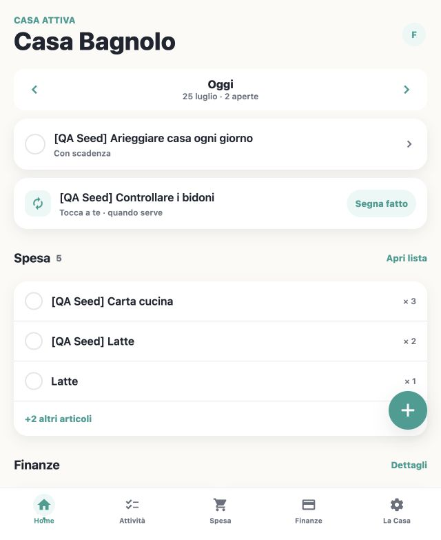

# Francesco Santi Portfolio

Portfolio personale e blog tecnico di Francesco Santi. Il sito presenta
esperienza professionale, formazione, progetti e articoli su sviluppo software,
algoritmi e sistemi.



## Contenuti principali

- Profilo professionale aggiornato e percorso lavorativo.
- Patti come case study full stack principale.
- Progetti precedenti e relativi repository.
- Blog statico basato su file MDX.
- Sitemap, robots, feed RSS e immagini Open Graph.

## Stack

- Next.js con App Router e React.
- TypeScript in modalità strict.
- Tailwind CSS.
- MDX per gli articoli.
- Vercel Analytics e Speed Insights.

## Avvio locale

Requisiti: Node.js 20.9 o successivo e Corepack abilitato.

```bash
corepack enable
pnpm install
cp .env.example .env.local
pnpm dev
```

Il sito sarà disponibile su [http://localhost:3000](http://localhost:3000).

## Controlli

```bash
pnpm lint
pnpm typecheck
pnpm format:check
pnpm build
```

Usare `pnpm lint:fix` e `pnpm format` per applicare le correzioni automatiche.

## Struttura

```text
app/
  blog/posts/       Articoli MDX
  components/       Sezioni e componenti condivisi
  config/           Configurazione del sito
  data/             Profilo, esperienza e formazione
  og/               Immagini social generate
public/img/         Immagini e screenshot
```

## Aggiungere un articolo

Creare un file `.mdx` in `app/blog/posts` con frontmatter valido:

```mdx
---
title: "Titolo"
publishedAt: "2026-07-25"
summary: "Descrizione breve dell'articolo."
image: "/img/immagine.png"
---

Contenuto dell'articolo.
```

`image` e `updatedAt` sono facoltativi. La build segnala il file e i campi non
validi prima della pubblicazione.

## Pubblicazione

Il progetto può essere pubblicato su Vercel o su qualsiasi piattaforma che
supporti Next.js. In produzione configurare:

```dotenv
SITE_URL=https://dominio.example
```

## CV pubblico

Non pubblicare il CV completo usato internamente. Prima di aggiungere il
download creare una versione pubblica senza indirizzo completo, data di
nascita, telefono e altri dati personali non necessari.
